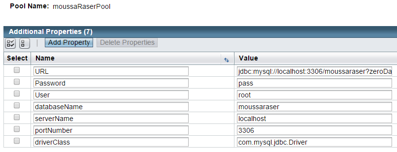
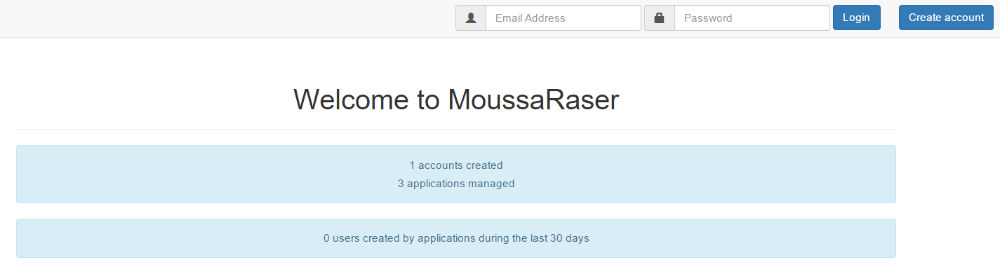
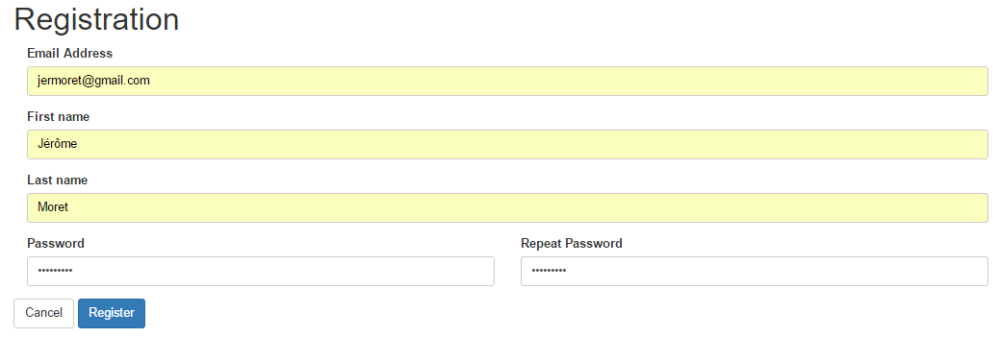
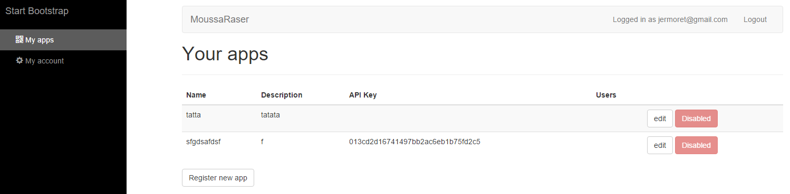
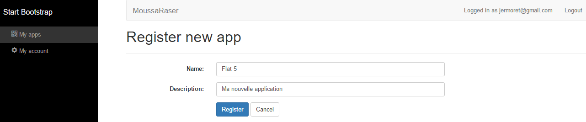
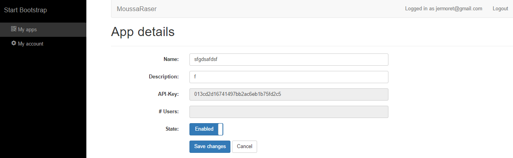
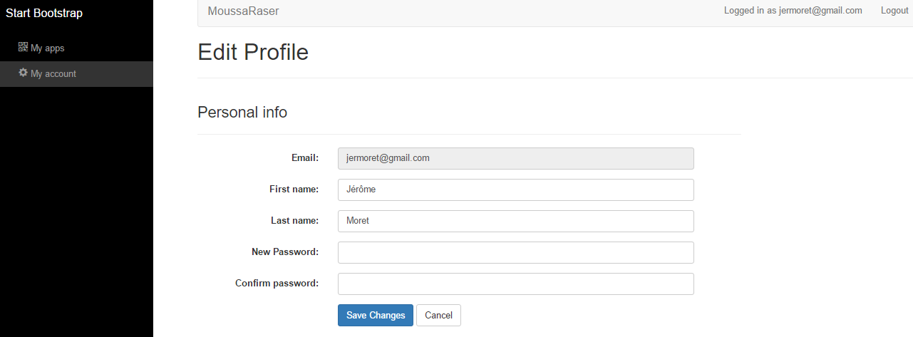
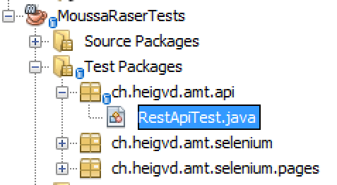
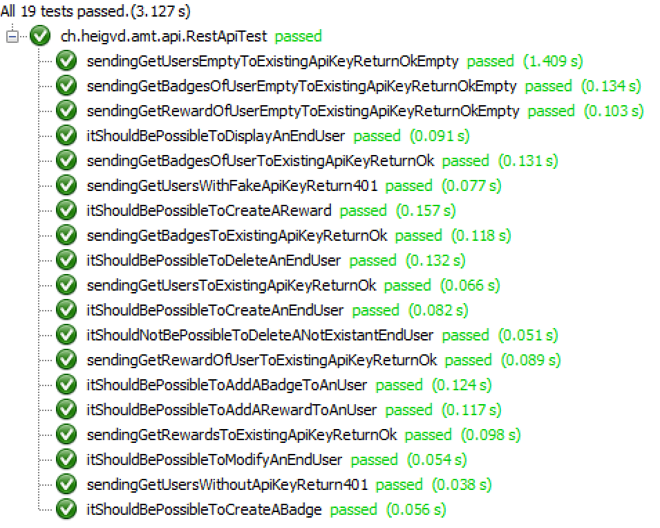
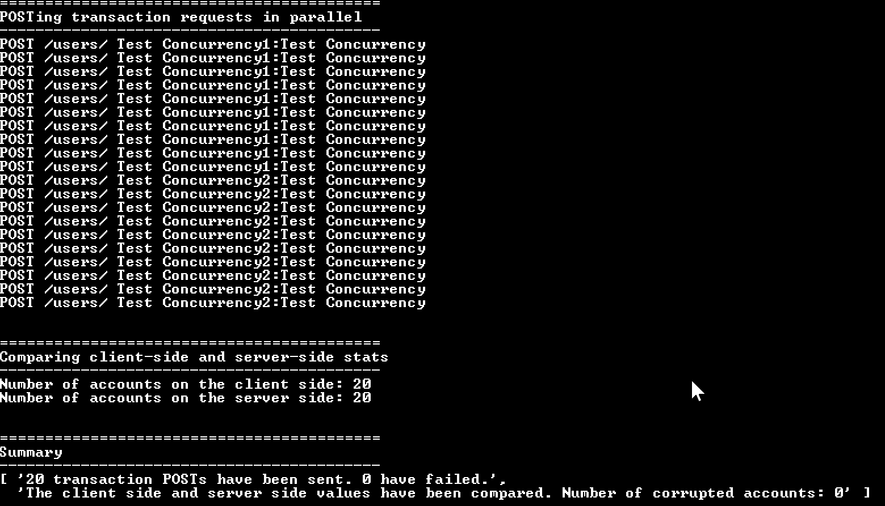

# Project Report

## Administrative information

### Team

- Dolt Mathias | Kjnokeer
- Duchoud Thibaud | Manamiz
- Ferreira Mario | UnsafeDriving
- Moret Jérôme | jermoret

## Introduction

Notre application a été développée à l’aide de la spécification Java EE. Dans notre cas, nous avons implémenté cette spécification grâce au serveur d’applications Glassfish d’Oracle. 
La persistance des données est gérée par JPA qui se connecte à une base de données MySQL à travers une source de données.

## User Guide
### Configuration

Pour pouvoir exécuter notre application, vous avez besoin de configurer :

- La base de données MySQL

Il vous suffit de créer une base de données portant le nom `moussaraser`.
Notre application tentera d’accéder à la base de données à travers l’identifiant 
`root` accompagné du mot de passe `pass`.

- Un pool de connexion JDBC

Pour cela, le plus simple est d’utiliser la console d’administration graphique atteignable au travers de l’adresse suivante : `http://<adresse_ip_serveur_glassfish>:4848/`.

Vous pourrez ensuite dans l’onglet des ressources, puis dans celui de JDBC, créer le pool de connexion dont nos propriétés figurent sur l’image ci-dessous.

Il est important que le nom du pool soit bien le suivant : **moussaRaserPool**.

- Une ressource JDBC

Dans le même menu que pour le pool de connexion JDBC, créez une ressource JDBC liée au pool précédemment créé et portant le nom suivant : **jdbc/moussaRaserDS**.

- D’un IDE supportant la spécification Java EE ainsi que Glassfish

Nous avons utilisé l’IDE NetBeans qui réalise de manière remarquable cette tâche. Si vous utilisez NetBeans, il vous suffit d’importer le projet maven présent dans `projet/MoussaRaser`. Effectuez ensuite un `Clean and Build`. Enfin vous pourrez effectuer un `Run` qui se chargera de déployer automatiquement l’application sur Glassfish.

Vous pouvez, dès lors, accéder à l’application sur `http://<adresse_ip_serveur_glassfish>:8080/MoussaRaser/`.
### Utilisation

#### Website pages
##### Home page

Vous pouvez ici soit vous loggez au sein de l'application ou alors créer un compte si vous n'en possédez pas.
##### Registration page

##### My apps page

Cette page donne un resumé de vos applications, il est possible de modifier les propriétés d'une application à l'aide du bouton `edit`. 

Vous pouvez également enregister une nouvelle application à l'aide du bouton `Register new app`. 
###### Register new app page

###### Edit app page

##### My account page

#### API REST
Une documentation auto-generée par Enunciate peut être consultée ici : [Documentation API REST](apiDocs/index.html)

#### JUnit
Pour les tests unitaires, il faut tout d'abord il faut lancer le serveur web.

Ensuite, ouvrir le projet "MoussaRaserTests" dans NetBeans et faire un "Clean and Build".

Pour finir, il faut simplement appuyer sur la touche "F6" (Tests).

#### JMeter
Dans le cas des tests de charge, il faut simplement ouvrir les fichier "MoussaRaser Pool.jmx" et appuyer sur le bouton "Play".

#### JUnit (Jersey)
Pour les tests unitaires, il faut tout d'abord il faut lancer le serveur web et importer le fichier "moussaraser.sql" (projet/DataToTest).

Ensuite, ouvrir le projet "MoussaRaserTests" dans NetBeans et faire un "Clean and Build".

Pour finir, il faut simplement sélectionner le fichier "RestApiTest.java" et appuyer sur la touche "F6" (Tests).

#### Concurrency (Node.js)
Pour les tests de concurrence, il faut tout d'abord il faut lancer le serveur web et importer le fichier "moussaraser.sql" (projet/DataToTest).

Ensuite, ouvrir une console (projet/MoussaRaserApiTest) et taper les commandes suivantes:
1. npm install
2. node client.js

## Testing and validation
### Tools
Pour tester la partie 2 de notre projet nous avons utilisé 2 "méthodes":

- Pour le fonctionnement de notre API nous avons utilisé des tests unitaires à l'aide de Jersey Client.
- Pour la concurrence de notre API nous avons utilisé un code en Node.js en s'inspirant de l'exemple vu en pendant les cours théoriques.

### Procedures
#### Fonctionnement ####
Pour les tests unitaires nous nous sommes inspirés de l'exemple vu en classe, nous avons créé une classe RestApiTest.java.

#### Concurrence ####
Pour les tests de concurrence nous avons crée une application en Node.js en s'inspirant de l'exemple du cours pour tester la concurrence d'attribution de rewards à un utilisateur.

### Results

#### Fonctionnement ####

Comme vous pouvez le constater dans l'image au-dessus, tous les tests passent sans problème.
Nous avons réalisé plusieurs tests:
- Lister les utilisateur d'une application.
- Supprimer un utilisateur d'une application.
- Ajouter un utilisateur à une application.
- Lister de badges d'un utilisateur.
- Supprimer un badge d'un utilisateur.
- Ajouter un badge à un utilisateur.
- Lister les rewards d'un utilisateur.
- Supprimer un reward d'un utilisateur.
- Ajouter un reward à un utilisateur.
- Lister les badges d'une application.
- Lister les rewards d'une appliaction.

#### Concurrence ####

Comme vous pouvez le constater dans l'image au-dessus le nombre de rewards créé est le même sur le serveur et le client.

