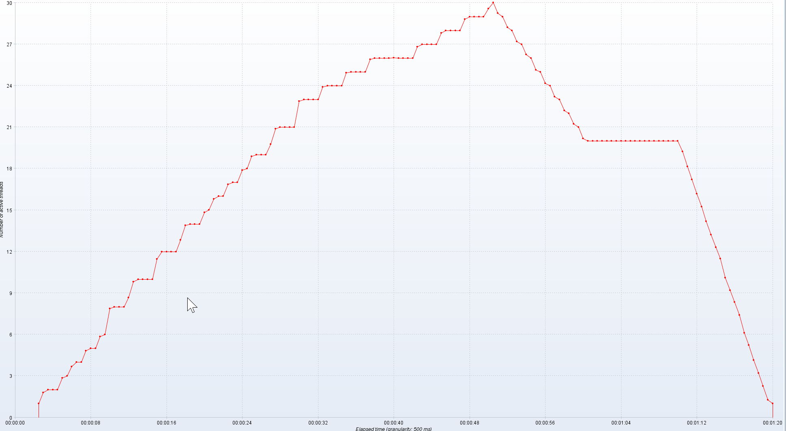
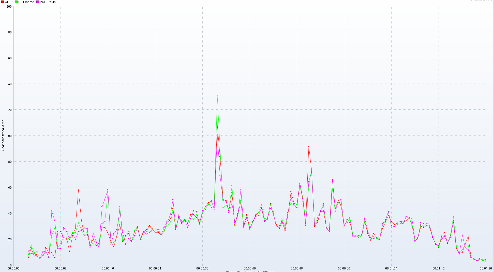
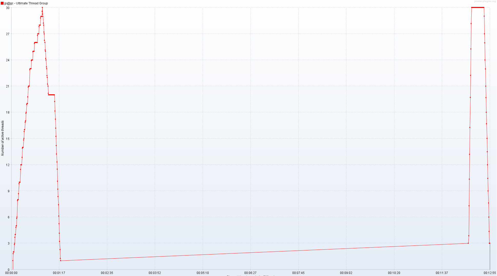
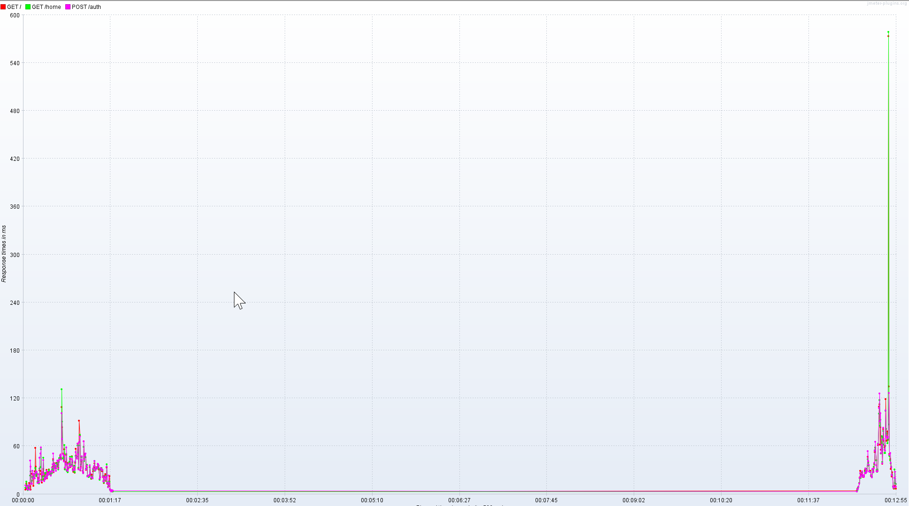

# Tests #
## Selenium ##
### Description ###
Dans cette section du rapport nous allons vous parler des tests unitaires réalisés avec Selenium.
### Tests ###
#### Connexion ####
**Identifiants corrects**

Lors de la connexion avec des identifiants corrects, l'utilisateur devrait être redirigé vers la page d’accueil.

Résultat : 

**Identifiants incorrects**

Lors de la connexion avec des identifiants incorrects, l'utilisateur devrait rester sur la même page, page de connexion.

Résultat : 

#### Création d'un nouveau compte ####
**Données correctes**

Lors de la création d’un nouveau compte avec toutes les informations nécessaires correctes, l’utilisateur devrait être redirigé vers la page de connexion.

Résultat : 

**Mots de passe différents**

Lors de la création d’un nouveau compte, si le mot de passe et sa confirmation sont différents, l’utilisateur devrait rester sur la même page, page d’enregistrement.

Résultat :

**Mot de passe manquant**

Lors de la création d’un nouveau compte, si le mot de passe manque, l’utilisateur devrait rester sur la même page, page d’enregistrement.

Résultat :

**Prénom manquant**

Lors de la création d’un nouveau compte, si le prénom manque, l’utilisateur devrait rester sur la même page, page d’enregistrement.

Résultat :

**Nom manquant**

Lors de la création d’un nouveau compte, si le nom manque, l’utilisateur devrait rester sur la même page, page d’enregistrement.

Résultat :

**Adresse mail manquante**

Lors de la création d’un nouveau compte, si l’adresse mail manque, l’utilisateur devrait rester sur la même page, page d’enregistrement.

Résultat :

**Utilisateur déjà existant**

Lors de la création d’un nouveau compte, si l’utilisateur existe déjà (adresse mail), l’utilisateur devrait rester sur la même page, page d’enregistrement.

Résultat :

#### Modification d'un compte ####
**Données correctes**

Lors de la modification d’un compte avec toutes les informations nécessaires correctes, l’utilisateur devrait être redirigé vers la page d’accueil.

Résultat :

**Mots de passe différents**
Lors de la modification d’un compte, si le mot de passe et sa confirmation sont différents, l’utilisateur devrait rester sur la même page, page de modification de compte.

Résultat :

**Mot de passe manquant**
Lors de la modification d’un compte, si le mot de passe manque, l’utilisateur devrait rester sur la même page, page de modification de compte.

Résultat :

**Prénom manquant**

Lors de la modification d’un compte, si le prénom manque, l’utilisateur devrait rester sur la même page, page de modification de compte.

Résultat :

**Nom manquant**

Lors de la modification d’un compte, si le nom manque, l’utilisateur devrait rester sur la même page, page de modification de compte.

Résultat :

#### Navigation dans l'accueil ####
**Logout**

Lors du clic sur « Logout », l’utilisateur devrait se déconnecter et être redirigé vers la page de connexion. 

Résultat :

**Liste d'utilisateurs**

Lors du clic sur le nombre d’utilisateurs d’une application, l’utilisateur devrait être redirigé vers la page avec la liste de nombre d’utilisateurs de l’application. 

Résultat :

#### Création d'une application ####
**Données correctes**

Lors de la création d’une application avec toutes les informations correctes, l’utilisateur devrait être redirigé vers la page d’accueil.

Résultat :

**Nom manquant**

Lors de la création d’une application avec le nom manquant, l’utilisateur devrait rester sur la même page, page de création d’une application.

Résultat :

#### Modification d'une application ####
**Données correctes**

Lors de la modification d’une application avec toutes les informations correctes, l’utilisateur devrait être redirigé vers la page d’accueil.

Résultat :

**Nom manquant**

Lors de la modification d’une application avec le nom manquant, l’utilisateur devrait rester sur la même page, page de modification d’une application.

Résultat :

## JMeter ##
### Description ###
Dans cette section du rapport nous allons vous parler des tests de surcharge réalisés avec JMeter.

Dans cette phase du projet nous avons seulement réalisé des tests de surcharge. Plusieurs personnes qui se connectent en même temps et qui chargent plusieurs fois la page d'accueil.
### Tests ###
Voici les résultats obtenus dans le cas où le nombre d'utilisateurs en simultané augmente doucement:

Nombre d'utilisateurs en simultané (threads) :

Temps d'attente (ms) :

Comme vous pouvez le constater, les temps de réponse restent corrects même avec une grande quantité d'utilisateurs qui se connectent en même temps. Nous avons un pique au moment où il y a le plus grand nombre d'utilisateurs connectés. (~50 msec)

Les différentes requêtes possèdent le même temps de réaction.

Voici les résultats obtenus dans le cas où le nombre d'utilisateurs en simultané augmente assez rapidement:

Nombre d'utilisateurs en simultané (threads) :

Temps d'attente (ms) :

Dans ce cas, le temps de réponse reste correcte, même si un peu plus élevé (~120 msec) rester correct, notre système réponds correctement à une grande quantité de requêtes. 

Par contre, nous constatons un pique (~540 msec) lors de l'affichage de la page d'accueil après la connexion de l'utilisateur (~00:12:00). Ce pique arrive au moment d'une surcharge constante. Après plusieurs tests, ce pique est régulier, mais nous n'avons pas trouvé la cause. 

